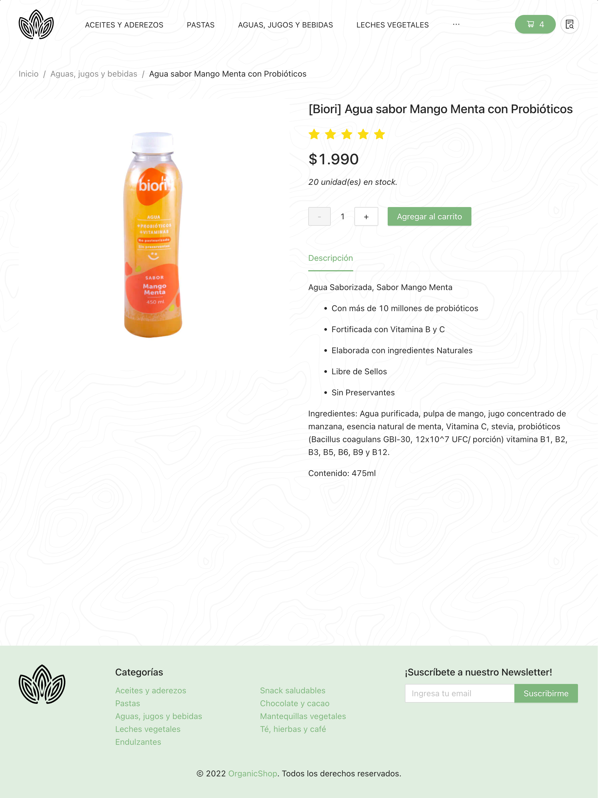

# OrganicShop

**Proyecto final del curso React Js - CoderHouse**

### Tecnologías y herramientas
- **CRACO (Create React App Configuration Override)**: V7.0.0-alpha.0
- **Ant Design Library**: V4.22.8
- **Craco-Less**: V2.1.0-alpha.0
- **Firebase**: V9.11.0

### Instalación
Clonar el proyecto

```bash
  git clone https://github.com/DaniiPoblete/organicshop.git
```

Ir al directorio del proyecto

```bash
  cd react-project
```

Instalar dependencias

```bash
  npm install
```

Iniciar servidor

```bash
  npm start
```

### Screenshots del sitio

#### Vista escritorio Productos por Categoría


#### Vista escritorio Detalle de Producto

